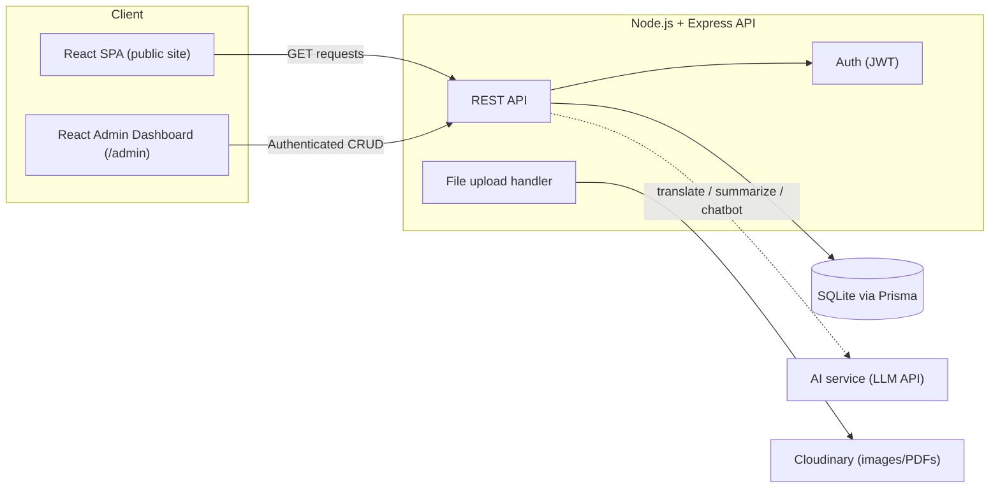

# Zanzarda Primary School Webapp — Project Documentation

**Zanzarda Primary School, Junagadh, Gujarat** — a bilingual (Gujarati/English) government-school website with a lightweight admin CMS, built as a full-stack portfolio project.

## Table of Contents
1. [Project Overview](#1-project-overview)
2. [Tech Stack](#2-tech-stack)
3. [Architecture](#3-architecture)
4. [Database Schema](#4-database-schema)
5. [Backend — API Endpoints](#5-backend--api-endpoints)
6. [Frontend — Pages, Routes & Components](#6-frontend--pages-routes--components)
7. [Where to Use AI](#7-where-to-use-ai)
8. [Build Roadmap](#8-build-roadmap)
9. [Deployment Plan](#9-deployment-plan)
10. [Sitemap & Page Functions (Reference)](#10-sitemap--page-functions-reference)
11. [Design System (Reference)](#11-design-system-reference)
12. [Execution Plan (Follow in Order)](#12-execution-plan-follow-in-order)

---

## 1. Project Overview

A public-facing school website (16 pages) backed by a small admin CMS so non-technical staff can post notices, update results, and manage gallery/staff content without touching code. Content is bilingual (Gujarati primary, English secondary) throughout.

**Core principle:** without an easy admin panel, the site goes stale within a term — so the CMS is not an add-on, it's the backbone of the build.

---

## 2. Tech Stack

| Layer | Choice | Why |
|---|---|---|
| Frontend | **React (Vite) + Tailwind CSS + React Router** | Matches your existing React skillset; Vite keeps builds fast; Tailwind speeds up matching the Figma design tokens directly |
| State/Data | **TanStack Query** (server state) + **React Context** (language + auth state) | Avoids over-engineering with Redux for a site this size |
| i18n | **i18next + react-i18next** | Standard bilingual toggle pattern; static UI strings in `en.json`/`gu.json`, DB content stores `_en`/`_gu` fields directly |
| Backend | **Node.js + Express** | Same language as frontend — one skillset, faster iteration |
| ORM | **Prisma** | Type-safe queries, painless schema migrations |
| Database | **SQLite** (dev + production) | A single small school = low concurrent traffic; SQLite is genuinely sufficient here, zero DB server to manage. Migrate to Postgres/MySQL only if traffic ever demands it |
| File storage | **Cloudinary (free tier)** | Images/PDFs need persistent storage; avoids filesystem persistence issues on free hosting |
| Auth | **JWT** (short-lived access + refresh token), bcrypt password hashing | Only a handful of admin users — no need for a heavier auth provider |
| Hosting (frontend) | **Vercel** (free tier) | Auto-deploys from GitHub, generous free tier |
| Hosting (backend) | **Render** or **Railway** (free/low-cost tier) | Simple Node deploys; note SQLite needs a persistent disk (paid tier) — see [Deployment Plan](#9-deployment-plan) |

---

## 3. Architecture



- **Single Express API** serves both the public site (read-only endpoints) and the admin dashboard (authenticated CRUD endpoints).
- **Admin dashboard** is a protected route tree (`/admin/*`) inside the same React app — no need for a separate deployable.
- **AI service** is called from specific backend endpoints (translation assist, summarization, chatbot) — never directly from the frontend, so API keys stay server-side.

---

## 4. Database Schema

```
users
  id              PK
  name            text
  email           text, unique
  password_hash   text
  role            enum('superadmin','editor')
  created_at      datetime
  updated_at      datetime

notices
  id              PK
  title_en        text
  title_gu        text
  description_en  text
  description_gu  text
  category        enum('circular','holiday','exam','general')
  pdf_url         text, nullable
  published_date  date
  created_by      FK -> users.id
  created_at      datetime
  updated_at      datetime

staff
  id              PK
  name            text
  role            enum('principal','teacher','non_teaching')
  subject         text, nullable
  qualification   text
  photo_url       text, nullable
  display_order   integer
  created_at      datetime

smc_members
  id              PK
  name            text
  designation     text
  term_start      date
  term_end        date
  created_at      datetime

achievements
  id              PK
  title_en        text
  title_gu        text
  level           enum('student','school')
  category        enum('sports','academics','cultural')
  year            integer
  photo_url       text, nullable
  created_at      datetime

gallery_items
  id              PK
  title           text
  category        enum('events','sports','cultural','competitions')
  media_url       text
  media_type      enum('photo','video')
  event_date      date
  created_at      datetime

results
  id                PK
  academic_year     text
  exam_type         enum('SSC','HSC','Gunotsav')
  class_std         text
  pass_percentage   decimal
  notes             text, nullable
  created_at        datetime

download_forms
  id              PK
  name_en         text
  name_gu         text
  category        enum('admission','scholarship','certificate')
  file_url        text
  uploaded_at     datetime

contact_messages
  id              PK
  name            text
  email           text, nullable
  phone           text, nullable
  subject         text
  message         text
  status          enum('new','read','responded')
  submitted_at    datetime

grievances
  id              PK
  name            text, nullable   -- allow anonymous
  contact_info    text, nullable
  complaint_text  text
  status          enum('open','in_review','resolved')
  submitted_at    datetime

page_content
  id              PK
  page_key        text, unique   -- 'about', 'admission_faq', 'vision_mission', etc.
  content_en      text (JSON)
  content_gu      text (JSON)
  updated_at      datetime
```

---

## 5. Backend — API Endpoints

**Auth**
```
POST   /api/auth/login
POST   /api/auth/logout
GET    /api/auth/me
```

**Public (read-only, no auth)**
```
GET    /api/notices?category=&page=
GET    /api/notices/:id
GET    /api/staff
GET    /api/smc
GET    /api/achievements?level=&category=
GET    /api/gallery?category=
GET    /api/results?year=
GET    /api/downloads?category=
GET    /api/pages/:key
POST   /api/contact
POST   /api/grievance
```

**Admin (JWT-protected)**
```
POST   /api/admin/notices          PUT/DELETE /api/admin/notices/:id
POST   /api/admin/staff            PUT/DELETE /api/admin/staff/:id
POST   /api/admin/achievements     PUT/DELETE /api/admin/achievements/:id
POST   /api/admin/gallery          PUT/DELETE /api/admin/gallery/:id
POST   /api/admin/results          PUT/DELETE /api/admin/results/:id
POST   /api/admin/downloads        PUT/DELETE /api/admin/downloads/:id
GET    /api/admin/contact-messages
GET    /api/admin/grievances       PUT /api/admin/grievances/:id
PUT    /api/admin/pages/:key
POST   /api/admin/upload           -- file upload -> Cloudinary, returns URL
```

**AI-assist (JWT-protected, admin-only)**
```
POST   /api/admin/ai/translate     -- { text, from, to } -> translated draft
POST   /api/admin/ai/summarize     -- long circular text -> short notice summary
POST   /api/admin/ai/alt-text      -- image URL -> accessible alt text
```

---

## 6. Frontend — Pages, Routes & Components

**Public routes** (matches the 16-page sitemap in [§10](#10-sitemap--page-functions-reference))
```
/                      Home
/about                 About Us
/administration        Administration & Staff
/academics             Academics
/admission             Admission
/notices               Notice Board
/notices/:id           Notice detail
/results                Results
/facilities             Facilities
/gallery                 Gallery
/achievements            Achievements
/downloads-contact       Downloads & Contact
/rti                     RTI
/smc                     SMC
/grievance                Grievance Redressal
/policies                 Website Policies
```

**Admin routes** (protected)
```
/admin/login
/admin/dashboard
/admin/notices        /admin/notices/new     /admin/notices/:id/edit
/admin/staff          (same CRUD pattern)
/admin/achievements    "
/admin/gallery         "
/admin/results          "
/admin/downloads        "
/admin/contact-messages
/admin/grievances
/admin/pages/:key/edit
```

**Reusable components** (already prototyped in Figma — same names carry over)
- `Header` / `Footer` (persistent, language toggle built in)
- `NoticeCard`, `QuickLinkTile`, `FacilityCard`, `AchievementCard`, `StaffCard`
- `LanguageToggle` (drives i18n context)
- `Pagination`
- `AdminLayout` / `AdminSidebar` / `ProtectedRoute`
- `AdminForm` (generic create/edit form shell reused across Notices/Staff/Achievements/etc.)

---

## 7. Where to Use AI

AI is a **phase-3 layer** on top of a working core CMS — sequenced last in the roadmap below so the functional site isn't blocked on it.

1. **Bilingual content assist** — staff writes a notice in Gujarati *or* English; an LLM call drafts the other language version for review before publishing. This is the single highest-value use case for a school where staff aren't fluent in both languages.
2. **Notice summarization** — long circular/PDF text → a 1–2 line summary shown on the notice card.
3. **Accessible alt-text generation** — auto-caption uploaded gallery/achievement photos (helps meet GIGW accessibility requirements).
4. **FAQ chatbot** — a small RAG-based assistant answering common parent questions (admission process, timings, facilities) from the site's own published content, in Gujarati or English.
5. **Grievance triage** — auto-categorize incoming grievances (urgent vs. routine) and flag inappropriate submissions for admin review.
6. **Content drafting** — turn a short structured input ("Khel Mahakumbh, taluka level, 1st prize, Std 7 team") into a polished achievement announcement.

---

## 8. Build Roadmap

The detailed, ordered checklist is in [§12](#12-execution-plan-follow-in-order). Work on one phase at a time and do not start a later phase until its completion gate passes.

---

## 9. Deployment Plan

- **Frontend**: Vercel, auto-deploy from GitHub `main` branch.
- **Backend**: Render or Railway. SQLite requires a **persistent disk** — confirm this is available on your chosen tier before relying on it in production; if not, swap Prisma's datasource to a free-tier hosted Postgres (e.g., Supabase) with no other code changes needed.
- **File storage**: Cloudinary free tier for all images/PDFs — keeps the backend stateless regardless of which host you land on.
- **Env vars**: `DATABASE_URL`, `JWT_SECRET`, `CLOUDINARY_*`, `AI_API_KEY` — never committed, set per-environment.

---

## 10. Sitemap & Page Functions (Reference)

### Core Public Pages (12)

**1. Home** — School name, logo, motto in Gujarati + English · Slider: recent notices, top 3 achievements, upcoming events · Quick links: Admission, Results, Notice Board, Contact · UDISE code, affiliation board (GSEB), medium of instruction displayed.

**2. About the School** — History, vision & mission · Infrastructure summary · School UDISE/registration details.

**3. Principal / HM's Message** — Photo + short message · Academic year vision.

**4. Administration & Staff** — Principal, teaching staff, non-teaching staff (name, subject/role, qualification) · SMC member list.

**5. Academics** — Std-wise (1–8) subjects and GSEB syllabus links · Time table (downloadable PDF) · Exam schedule.

**6. Admission** — RTE 25% quota process and eligibility · Required documents checklist · Admission calendar · Downloadable/online admission form.

**7. Notice Board / Circulars** — Govt/DEO circulars, holiday list, exam notices · Sorted by date, filterable, PDF attachments · Staff-editable via admin panel.

**8. Results & Academic Performance** — SSC/HSC result summary, class-wise pass % · Gunotsav/state assessment scores · Year-on-year trend.

**9. Facilities** — Library, computer lab, playground · Drinking water, separate girls'/boys' toilets · Mid-Day Meal Scheme details.

**10. Gallery** — Event/competition photos and videos, organized by year/event.

**11. Achievements** — Student-level and school-level awards · Sports, academics, cultural competitions.

**12. Downloads & Contact** — Forms: transfer certificate, scholarship, bonafide certificate · Address, map, phone, email (school + DEO) · Contact form.

### Government-Mandated Compliance Pages (4)

**13. SMC** — Member list, formation date, meeting minutes (mandatory under RTE Act Sec. 21).

**14. RTI** — Public Information Officer (PIO) name/contact · RTI application process.

**15. Grievance Redressal** — Complaint/feedback form · Link to state helpline/RTE grievance portal.

**16. Website Policies** — Accessibility statement, privacy policy, terms of use, hyperlinking policy, sitemap link.

### Admin Panel (essential, not a public page)
Post/edit notices and circulars · update results, gallery, staff list · manage admission form submissions.

### Phase-2 / Optional Growth Modules
Student/Parent login portal · alumni network · news/blog · e-library · online fee/scholarship tracking.

### Gujarat-Specific Notes
Bilingual by default (Gujarati + English, Hindi optional third) · reference Gunotsav, Vidhyalaxmi Bond, Mid-Day Meal Scheme, RTE 25% admission where relevant · low-bandwidth-friendly design (rural 3G/4G mobile access) · UDISE code and GSEB affiliation number visible on Home and About.

---

## 11. Design System (Reference)

### Color Palette (from the school logo)

| Role | Color | Hex |
|---|---|---|
| Primary (header, nav, buttons) | Teal Blue | `#2D89A3` |
| Accent 1 | Orange | `#E8833C` |
| Accent 2 | Green | `#5CAA46` |
| Text / Icons | Charcoal | `#2B2B2B` |
| Background | Off-white | `#FDFBF7` |

### Persistent Elements

**Header/Nav** — Logo (tree emblem) + school name (Gujarati primary, English below) · Nav: Home · About · Academics · Admission · Notices · Results · Gallery · Facilities · Achievements · Downloads/Contact · ગુજરાતી/EN toggle, top right.

**Footer** — Address + map pin · Phone/email · Quick links (repeats nav) · RTI · SMC · Grievance Redressal · Website Policies · UDISE code.

### Figma Reference
The Home page has already been built in Figma with this palette and these components (Header, Hero, Notice Card, Quick Link Tile, Facility Card, Achievement Card, Footer) — reuse those component names 1:1 in the React build for a direct design→code mapping.

---

## 12. Execution Plan (Follow in Order)

This is the working build sequence for the project. Each phase must leave the repository in a runnable state. Keep secrets in local environment files only; never commit credentials, private school records, generated uploads, or production database files.

### Phase 0 — Confirm Inputs and Workspace

**Goal:** remove ambiguity before implementation begins.

**Tasks**

- Confirm the final school identity: official Gujarati name, English name, motto, address, phone, email, UDISE code, GSEB/affiliation details, and map location.
- Confirm whether `Design/` is the approved visual reference and identify the logo, school photographs, staff photographs, and other assets that may be used.
- Confirm the first admin account owner and deployment accounts later needed for GitHub, Vercel, Render/Railway, Cloudinary, and the AI provider.
- Confirm the initial content language workflow: Gujarati-first, English-first, or either language with translation assistance.
- Decide whether the first release uses SQLite with a persistent disk or PostgreSQL from the beginning.

**Deliverables**

- A completed school-information and asset checklist.
- A local development environment with Node.js, npm, and Git available.
- A written decision for database and hosting targets.

**Completion gate:** do not invent official school facts, personal details, logos, or photographs. Ask the user for missing data or permission to use placeholders.

### Phase 1 — Project Foundation

**Goal:** create the full-stack workspace and baseline developer workflow.

**Tasks**

- Create a frontend React/Vite app with Tailwind CSS and React Router.
- Create a backend Node.js/Express app with a health endpoint and environment configuration.
- Add shared scripts for development, production build, linting, and tests.
- Add `.gitignore` and environment templates such as `.env.example`; keep real `.env` files untracked.
- Configure the design tokens from §11 and the Gujarati-capable font strategy.
- Establish the frontend folders for pages, reusable components, contexts, API clients, and translations.
- Establish the backend folders for routes, controllers, services, middleware, validation, and configuration.

**Deliverables**

- Frontend loads at the local development URL.
- Backend health endpoint responds successfully.
- Frontend can reach the backend through the configured API base URL.

**Completion gate:** a clean install, development start, production build, and basic test command all work.

### Phase 2 — Database and Seed Data

**Goal:** implement the schema in §4 before building content-dependent screens.

**Tasks**

- Initialize Prisma and the selected database.
- Model all entities in §4, including relations, enums, nullable fields, timestamps, and indexes needed for listing/filtering.
- Add migrations and a seed script for a development admin user and clearly marked sample content.
- Hash seed passwords with bcrypt; never store plaintext passwords.
- Add validation rules for bilingual fields, dates, percentages, categories, statuses, and uploaded URLs.
- Document how to reset and reseed the development database.

**Deliverables**

- Reproducible migration and seed commands.
- Database records available for notices, staff, SMC, achievements, gallery, results, downloads, contact messages, grievances, and page content.

**Completion gate:** migrations run from an empty database and the seed script can be run repeatedly without corrupting data.

### Phase 3 — Backend API and Authentication

**Goal:** deliver the secure API contract defined in §5.

**Tasks**

- Implement public read endpoints and pagination/filter query handling.
- Implement contact and grievance submission endpoints with server-side validation and safe error responses.
- Implement JWT login, logout, refresh handling if used, and `/api/auth/me`.
- Implement authentication and role middleware for `superadmin` and `editor`.
- Implement admin CRUD endpoints for notices, staff, achievements, gallery, results, downloads, contact messages, grievances, and page content.
- Implement upload handling with file type/size validation and a storage service boundary for Cloudinary.
- Add API tests for success, validation failure, unauthenticated access, unauthorized roles, not-found records, and malformed IDs.
- Add CORS, security headers, rate limits for public forms, structured logging, and centralized error handling.

**Deliverables**

- A tested REST API matching the endpoint list in §5.
- An API request collection or equivalent developer documentation.

**Completion gate:** protected endpoints cannot be called without the correct role, public forms reject invalid input, and tests pass against a fresh seeded database.

### Phase 4 — Design System and Shared Frontend Shell

**Goal:** make the visual foundation match the approved design reference.

**Tasks**

- Build `Header`, `Footer`, `LanguageToggle`, responsive navigation, and the global page layout.
- Implement the palette, spacing, typography, focus states, buttons, forms, loading states, empty states, and error states from §11.
- Build `NoticeCard`, `QuickLinkTile`, `FacilityCard`, `AchievementCard`, `StaffCard`, and `Pagination` using the documented names.
- Add English and Gujarati translation files for all static UI strings.
- Add a language context that persists the selected language and updates document direction/metadata where needed.
- Use approved project assets; request missing images or manual design confirmation before replacing them with placeholders.

**Deliverables**

- A responsive shell visible on desktop and mobile.
- Reusable components with representative states.

**Completion gate:** keyboard focus is visible, text does not overlap at mobile widths, and the language toggle works in the shared shell.

### Phase 5 — Public Website MVP

**Goal:** launch the public read-only experience using live API data.

**Tasks**

- Build the Home page with school identity, motto, notices, achievements, quick links, upcoming events, UDISE, affiliation, and medium of instruction.
- Build About, Administration/Staff, Academics, Admission, Notices/list and detail, Results, Facilities, Gallery, Achievements, and Downloads/Contact pages.
- Connect every data-backed view to TanStack Query and the API; include loading, error, empty, pagination, and filter states.
- Build the RTI, SMC, Grievance, and Website Policies pages as the compliance set.
- Add responsive routing, page titles, metadata, accessible images, and downloadable file links.
- Keep the public site usable with seeded sample data while clearly marking content that still requires official replacement.

**Deliverables**

- All public routes in §6 resolve and render.
- Public content can be viewed in English and Gujarati.

**Completion gate:** every route has a working navigation path, no route exposes admin actions, and the public app works against the API without hardcoded production secrets.

### Phase 6 — Admin CMS

**Goal:** allow authorized staff to maintain the public website without code changes.

**Tasks**

- Build `/admin/login`, `AdminLayout`, `AdminSidebar`, `ProtectedRoute`, and dashboard summary states.
- Build generic `AdminForm` patterns and CRUD screens for notices, staff, achievements, gallery, results, downloads, and editable page content.
- Add contact-message and grievance queues with status updates and safe detail views.
- Add upload UI connected to `/api/admin/upload`, including previews, validation, progress, and failure recovery.
- Enforce role-aware controls in the UI while keeping authorization enforced by the backend.
- Add unsaved-change protection, confirmation for destructive actions, and success/error feedback.

**Deliverables**

- An editor can create, edit, publish, and delete permitted content.
- Public pages reflect CMS changes after cache invalidation/refetch.

**Completion gate:** a seeded admin can complete a notice and gallery update end to end, and an unauthorized user cannot access the CMS.

### Phase 7 — Forms, Bilingual Content, and Compliance Review

**Goal:** complete real-world school workflows and content quality.

**Tasks**

- Complete admission, contact, and grievance forms with validation, confirmation, spam protection, and admin visibility.
- Add bilingual editing fields and translation status to CMS forms.
- Verify RTI, SMC, grievance, privacy, accessibility, terms, hyperlinking, and sitemap content with the user.
- Replace sample content with approved official school data.
- Add Gujarati translations for all user-facing static and seeded content.
- Verify links to GSEB, RTE, Gunotsav, Vidhyalaxmi Bond, Mid-Day Meal Scheme, and relevant state portals before publishing.

**Deliverables**

- Approved bilingual content pack.
- Tested form submissions visible in the admin panel.

**Completion gate:** no official claim, contact detail, legal statement, or external link is published without user confirmation.

### Phase 8 — AI Assistance (Optional and Last)

**Goal:** add AI support without making core publishing depend on it.

**Tasks**

- Add server-side provider configuration and usage/error limits; never expose the AI key to the browser.
- Implement translation drafts, notice summaries, and image alt-text suggestions as reviewable drafts.
- Require an admin approval action before AI-generated text is published.
- Add prompt/input size limits, logging without sensitive content, timeout handling, and a manual fallback when the provider is unavailable.
- Add the FAQ chatbot only after published page content is stable; constrain answers to approved site content and provide a contact fallback.
- Treat grievance triage as a suggestion only; never automatically reject or resolve a complaint.

**Deliverables**

- Tested admin-only AI assist endpoints and UI.
- Human review flow for every AI-generated output.

**Completion gate:** the website remains fully usable when AI is disabled, and no AI feature publishes content automatically.

### Phase 9 — Quality, Accessibility, and Low-Bandwidth Polish

**Goal:** make the site reliable for rural mobile users and aligned with accessibility expectations.

**Tasks**

- Test keyboard navigation, focus order, headings, labels, contrast, alt text, language metadata, and screen-reader landmarks.
- Test responsive layouts at mobile, tablet, and desktop sizes.
- Optimize images, lazy-load non-critical media, reduce JavaScript, and verify useful loading states on slow connections.
- Add unit tests for components and utilities, integration tests for API/CMS workflows, and end-to-end tests for login, publishing, language switching, and public forms.
- Run linting, type checking, production builds, dependency/security checks, and migration checks.
- Verify no secret, private upload, database file, or personal test data is committed.

**Deliverables**

- Release checklist with test results and known limitations.
- Accessibility and performance findings resolved or documented.

**Completion gate:** all release-blocking tests pass and the user approves the final visual/content review.

### Phase 10 — Deployment and Handover

**Goal:** publish the application safely and make it maintainable.

**Tasks**

- Create production frontend and backend services using the choices in §9.
- Configure persistent database storage or switch to hosted PostgreSQL if the selected tier cannot safely persist SQLite.
- Configure Cloudinary and all production environment variables through hosting dashboards only.
- Run production migrations and create the first admin account through a secure process.
- Connect Vercel to GitHub `main`; configure backend CORS, frontend API URL, health checks, logs, and backups.
- Add custom domain and HTTPS only after the hosted environments work on their service URLs.
- Write an admin handover guide covering login, content publishing, uploads, translations, backups, and incident contact.

**Deliverables**

- Live public website and protected admin panel.
- Deployment notes, environment-variable inventory, backup plan, and handover guide.

**Completion gate:** production smoke tests pass for public browsing, admin login, notice publishing, upload, bilingual display, contact form, and grievance form.

### Working Rules for Every Phase

1. Read this file before starting the phase and preserve the API, route, schema, and component names unless a documented decision changes them.
2. Make the smallest coherent change, then run the narrowest relevant test or build check before continuing.
3. Ask the user before using or creating official images, personal data, credentials, legal text, school facts, or external service accounts.
4. Use placeholders only when they are clearly labeled as development content and easy to replace.
5. Never commit secrets, `.env` files, production databases, private uploads, or user-submitted contact/grievance data.
6. Keep AI optional: core public pages, forms, and CMS workflows must work without an AI provider.
7. At the end of each phase, record what is complete, what is blocked, and what user input is still required.

### Current Starting Point

Start with **Phase 0**, then proceed to **Phase 1 — Project Foundation**. Before implementation begins, request the missing official school details and approved assets listed in Phase 0. The existing `Design/` folder and this document are references; they are not a substitute for confirmed production content.
