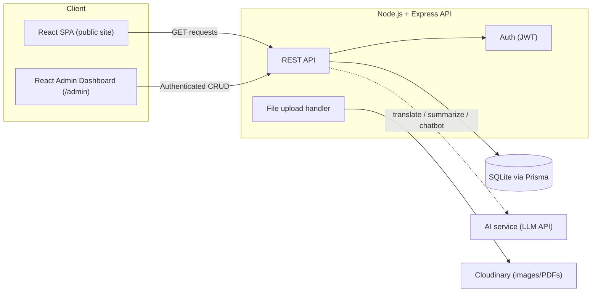

# Zanzarda Primary School Webapp — Project Documentation

**Zanzarda Primary School, Junagadh, Gujarat** — a bilingual (Gujarati/English) government-school website with a lightweight admin CMS, built as a full-stack portfolio project.

## Table of Contents
1. [Project Overview](#1-project-overview)
2. [Tech Stack](#2-tech-stack)
3. [Architecture](#3-architecture)
4. [Database Schema](#4-database-schema)
5. [Backend — API Endpoints](#5-backend--api-endpoints)
6. [Frontend — Pages, Routes & Components](#6-frontend--pages-routes--components)
7. [Where to Use AI](#7-where-to-use-ai)
8. [Build Roadmap](#8-build-roadmap)
9. [Deployment Plan](#9-deployment-plan)
10. [Sitemap & Page Functions (Reference)](#10-sitemap--page-functions-reference)
11. [Design System (Reference)](#11-design-system-reference)

---

## 1. Project Overview

A public-facing school website (16 pages) backed by a small admin CMS so non-technical staff can post notices, update results, and manage gallery/staff content without touching code. Content is bilingual (Gujarati primary, English secondary) throughout.

**Core principle:** without an easy admin panel, the site goes stale within a term — so the CMS is not an add-on, it's the backbone of the build.

---

## 2. Tech Stack

| Layer | Choice | Why |
|---|---|---|
| Frontend | **React (Vite) + Tailwind CSS + React Router** | Matches your existing React skillset; Vite keeps builds fast; Tailwind speeds up matching the Figma design tokens directly |
| State/Data | **TanStack Query** (server state) + **React Context** (language + auth state) | Avoids over-engineering with Redux for a site this size |
| i18n | **i18next + react-i18next** | Standard bilingual toggle pattern; static UI strings in `en.json`/`gu.json`, DB content stores `_en`/`_gu` fields directly |
| Backend | **Node.js + Express** | Same language as frontend — one skillset, faster iteration |
| ORM | **Prisma** | Type-safe queries, painless schema migrations |
| Database | **SQLite** (dev + production) | A single small school = low concurrent traffic; SQLite is genuinely sufficient here, zero DB server to manage. Migrate to Postgres/MySQL only if traffic ever demands it |
| File storage | **Cloudinary (free tier)** | Images/PDFs need persistent storage; avoids filesystem persistence issues on free hosting |
| Auth | **JWT** (short-lived access + refresh token), bcrypt password hashing | Only a handful of admin users — no need for a heavier auth provider |
| Hosting (frontend) | **Vercel** (free tier) | Auto-deploys from GitHub, generous free tier |
| Hosting (backend) | **Render** or **Railway** (free/low-cost tier) | Simple Node deploys; note SQLite needs a persistent disk (paid tier) — see [Deployment Plan](#9-deployment-plan) |

---

## 3. Architecture



- **Single Express API** serves both the public site (read-only endpoints) and the admin dashboard (authenticated CRUD endpoints).
- **Admin dashboard** is a protected route tree (`/admin/*`) inside the same React app — no need for a separate deployable.
- **AI service** is called from specific backend endpoints (translation assist, summarization, chatbot) — never directly from the frontend, so API keys stay server-side.

---

## 4. Database Schema

```
users
  id              PK
  name            text
  email           text, unique
  password_hash   text
  role            enum('superadmin','editor')
  created_at      datetime
  updated_at      datetime

notices
  id              PK
  title_en        text
  title_gu        text
  description_en  text
  description_gu  text
  category        enum('circular','holiday','exam','general')
  pdf_url         text, nullable
  published_date  date
  created_by      FK -> users.id
  created_at      datetime
  updated_at      datetime

staff
  id              PK
  name            text
  role            enum('principal','teacher','non_teaching')
  subject         text, nullable
  qualification   text
  photo_url       text, nullable
  display_order   integer
  created_at      datetime

smc_members
  id              PK
  name            text
  designation     text
  term_start      date
  term_end        date
  created_at      datetime

achievements
  id              PK
  title_en        text
  title_gu        text
  level           enum('student','school')
  category        enum('sports','academics','cultural')
  year            integer
  photo_url       text, nullable
  created_at      datetime

gallery_items
  id              PK
  title           text
  category        enum('events','sports','cultural','competitions')
  media_url       text
  media_type      enum('photo','video')
  event_date      date
  created_at      datetime

results
  id                PK
  academic_year     text
  exam_type         enum('SSC','HSC','Gunotsav')
  class_std         text
  pass_percentage   decimal
  notes             text, nullable
  created_at        datetime

download_forms
  id              PK
  name_en         text
  name_gu         text
  category        enum('admission','scholarship','certificate')
  file_url        text
  uploaded_at     datetime

contact_messages
  id              PK
  name            text
  email           text, nullable
  phone           text, nullable
  subject         text
  message         text
  status          enum('new','read','responded')
  submitted_at    datetime

grievances
  id              PK
  name            text, nullable   -- allow anonymous
  contact_info    text, nullable
  complaint_text  text
  status          enum('open','in_review','resolved')
  submitted_at    datetime

page_content
  id              PK
  page_key        text, unique   -- 'about', 'admission_faq', 'vision_mission', etc.
  content_en      text (JSON)
  content_gu      text (JSON)
  updated_at      datetime
```

---

## 5. Backend — API Endpoints

**Auth**
```
POST   /api/auth/login
POST   /api/auth/logout
GET    /api/auth/me
```

**Public (read-only, no auth)**
```
GET    /api/notices?category=&page=
GET    /api/notices/:id
GET    /api/staff
GET    /api/smc
GET    /api/achievements?level=&category=
GET    /api/gallery?category=
GET    /api/results?year=
GET    /api/downloads?category=
GET    /api/pages/:key
POST   /api/contact
POST   /api/grievance
```

**Admin (JWT-protected)**
```
POST   /api/admin/notices          PUT/DELETE /api/admin/notices/:id
POST   /api/admin/staff            PUT/DELETE /api/admin/staff/:id
POST   /api/admin/achievements     PUT/DELETE /api/admin/achievements/:id
POST   /api/admin/gallery          PUT/DELETE /api/admin/gallery/:id
POST   /api/admin/results          PUT/DELETE /api/admin/results/:id
POST   /api/admin/downloads        PUT/DELETE /api/admin/downloads/:id
GET    /api/admin/contact-messages
GET    /api/admin/grievances       PUT /api/admin/grievances/:id
PUT    /api/admin/pages/:key
POST   /api/admin/upload           -- file upload -> Cloudinary, returns URL
```

**AI-assist (JWT-protected, admin-only)**
```
POST   /api/admin/ai/translate     -- { text, from, to } -> translated draft
POST   /api/admin/ai/summarize     -- long circular text -> short notice summary
POST   /api/admin/ai/alt-text      -- image URL -> accessible alt text
```

---

## 6. Frontend — Pages, Routes & Components

**Public routes** (matches the 16-page sitemap in [§10](#10-sitemap--page-functions-reference))
```
/                      Home
/about                 About Us
/administration        Administration & Staff
/academics             Academics
/admission             Admission
/notices               Notice Board
/notices/:id           Notice detail
/results                Results
/facilities             Facilities
/gallery                 Gallery
/achievements            Achievements
/downloads-contact       Downloads & Contact
/rti                     RTI
/smc                     SMC
/grievance                Grievance Redressal
/policies                 Website Policies
```

**Admin routes** (protected)
```
/admin/login
/admin/dashboard
/admin/notices        /admin/notices/new     /admin/notices/:id/edit
/admin/staff          (same CRUD pattern)
/admin/achievements    "
/admin/gallery         "
/admin/results          "
/admin/downloads        "
/admin/contact-messages
/admin/grievances
/admin/pages/:key/edit
```

**Reusable components** (already prototyped in Figma — same names carry over)
- `Header` / `Footer` (persistent, language toggle built in)
- `NoticeCard`, `QuickLinkTile`, `FacilityCard`, `AchievementCard`, `StaffCard`
- `LanguageToggle` (drives i18n context)
- `Pagination`
- `AdminLayout` / `AdminSidebar` / `ProtectedRoute`
- `AdminForm` (generic create/edit form shell reused across Notices/Staff/Achievements/etc.)

---

## 7. Where to Use AI

AI is a **phase-3 layer** on top of a working core CMS — sequenced last in the roadmap below so the functional site isn't blocked on it.

1. **Bilingual content assist** — staff writes a notice in Gujarati *or* English; an LLM call drafts the other language version for review before publishing. This is the single highest-value use case for a school where staff aren't fluent in both languages.
2. **Notice summarization** — long circular/PDF text → a 1–2 line summary shown on the notice card.
3. **Accessible alt-text generation** — auto-caption uploaded gallery/achievement photos (helps meet GIGW accessibility requirements).
4. **FAQ chatbot** — a small RAG-based assistant answering common parent questions (admission process, timings, facilities) from the site's own published content, in Gujarati or English.
5. **Grievance triage** — auto-categorize incoming grievances (urgent vs. routine) and flag inappropriate submissions for admin review.
6. **Content drafting** — turn a short structured input ("Khel Mahakumbh, taluka level, 1st prize, Std 7 team") into a polished achievement announcement.

---

## 8. Build Roadmap

**Phase 1 — Core CMS**
DB schema + Prisma setup → backend CRUD APIs → admin auth → React public pages consuming live API data (Home, Notices, Staff, Results, Gallery, Achievements, Facilities).

**Phase 2 — Forms & Compliance**
Admission/Contact/Grievance forms → RTI/SMC/Policies pages → bilingual toggle wired across every page.

**Phase 3 — AI layer**
Bilingual translate-assist → notice summarizer → alt-text generator → FAQ chatbot.

**Phase 4 — Polish & Deploy**
Mobile/low-bandwidth optimization → accessibility audit (GIGW) → deploy → connect domain.

---

## 9. Deployment Plan

- **Frontend**: Vercel, auto-deploy from GitHub `main` branch.
- **Backend**: Render or Railway. SQLite requires a **persistent disk** — confirm this is available on your chosen tier before relying on it in production; if not, swap Prisma's datasource to a free-tier hosted Postgres (e.g., Supabase) with no other code changes needed.
- **File storage**: Cloudinary free tier for all images/PDFs — keeps the backend stateless regardless of which host you land on.
- **Env vars**: `DATABASE_URL`, `JWT_SECRET`, `CLOUDINARY_*`, `AI_API_KEY` — never committed, set per-environment.

---

## 10. Sitemap & Page Functions (Reference)

### Core Public Pages (12)

**1. Home** — School name, logo, motto in Gujarati + English · Slider: recent notices, top 3 achievements, upcoming events · Quick links: Admission, Results, Notice Board, Contact · UDISE code, affiliation board (GSEB), medium of instruction displayed.

**2. About the School** — History, vision & mission · Infrastructure summary · School UDISE/registration details.

**3. Principal / HM's Message** — Photo + short message · Academic year vision.

**4. Administration & Staff** — Principal, teaching staff, non-teaching staff (name, subject/role, qualification) · SMC member list.

**5. Academics** — Std-wise (1–8) subjects and GSEB syllabus links · Time table (downloadable PDF) · Exam schedule.

**6. Admission** — RTE 25% quota process and eligibility · Required documents checklist · Admission calendar · Downloadable/online admission form.

**7. Notice Board / Circulars** — Govt/DEO circulars, holiday list, exam notices · Sorted by date, filterable, PDF attachments · Staff-editable via admin panel.

**8. Results & Academic Performance** — SSC/HSC result summary, class-wise pass % · Gunotsav/state assessment scores · Year-on-year trend.

**9. Facilities** — Library, computer lab, playground · Drinking water, separate girls'/boys' toilets · Mid-Day Meal Scheme details.

**10. Gallery** — Event/competition photos and videos, organized by year/event.

**11. Achievements** — Student-level and school-level awards · Sports, academics, cultural competitions.

**12. Downloads & Contact** — Forms: transfer certificate, scholarship, bonafide certificate · Address, map, phone, email (school + DEO) · Contact form.

### Government-Mandated Compliance Pages (4)

**13. SMC** — Member list, formation date, meeting minutes (mandatory under RTE Act Sec. 21).

**14. RTI** — Public Information Officer (PIO) name/contact · RTI application process.

**15. Grievance Redressal** — Complaint/feedback form · Link to state helpline/RTE grievance portal.

**16. Website Policies** — Accessibility statement, privacy policy, terms of use, hyperlinking policy, sitemap link.

### Admin Panel (essential, not a public page)
Post/edit notices and circulars · update results, gallery, staff list · manage admission form submissions.

### Phase-2 / Optional Growth Modules
Student/Parent login portal · alumni network · news/blog · e-library · online fee/scholarship tracking.

### Gujarat-Specific Notes
Bilingual by default (Gujarati + English, Hindi optional third) · reference Gunotsav, Vidhyalaxmi Bond, Mid-Day Meal Scheme, RTE 25% admission where relevant · low-bandwidth-friendly design (rural 3G/4G mobile access) · UDISE code and GSEB affiliation number visible on Home and About.

---

## 11. Design System (Reference)

### Color Palette (from the school logo)

| Role | Color | Hex |
|---|---|---|
| Primary (header, nav, buttons) | Teal Blue | `#2D89A3` |
| Accent 1 | Orange | `#E8833C` |
| Accent 2 | Green | `#5CAA46` |
| Text / Icons | Charcoal | `#2B2B2B` |
| Background | Off-white | `#FDFBF7` |

### Persistent Elements

**Header/Nav** — Logo (tree emblem) + school name (Gujarati primary, English below) · Nav: Home · About · Academics · Admission · Notices · Results · Gallery · Facilities · Achievements · Downloads/Contact · ગુજરાતી/EN toggle, top right.

**Footer** — Address + map pin · Phone/email · Quick links (repeats nav) · RTI · SMC · Grievance Redressal · Website Policies · UDISE code.

### Figma Reference
The Home page has already been built in Figma with this palette and these components (Header, Hero, Notice Card, Quick Link Tile, Facility Card, Achievement Card, Footer) — reuse those component names 1:1 in the React build for a direct design→code mapping.
